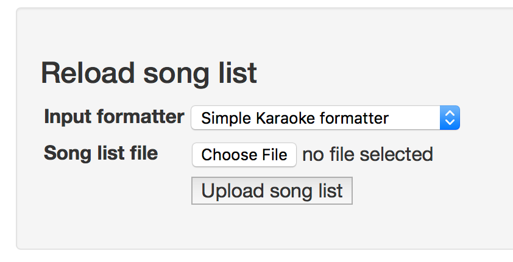
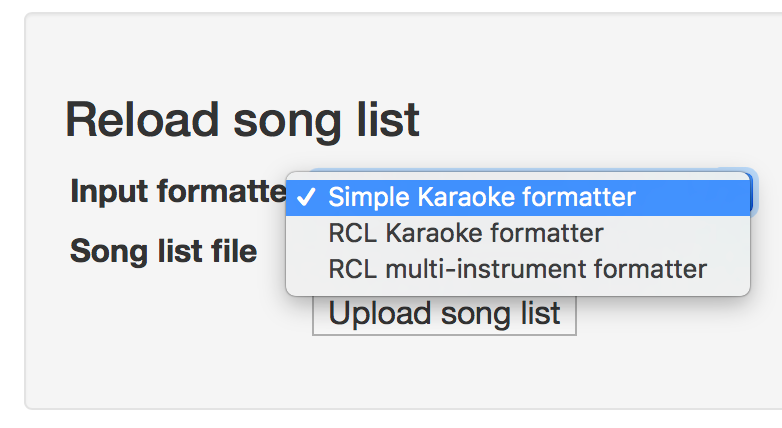

Song list processors
====================

Song lists can be uploaded as Excel spreadsheets via the settings page.

Three upload formatters are included to accept data in various formats:

 - The Simple Karaoke formatter expects Song, Band, and Duration (in minutes:seconds) in columns A, B and C, with one header row.
 - The two RCL formatters are custom for Rock Club London, and load spreadsheets with a different column layout containing 
 varying instrument lists for each song as well as source & platform data.
   - The RCL multi-instrument formatter loads full instrument data for Rock Band games
   - The RCL Karaoke formatter uses the same file format but loads as vocals only
   
### Custom formatters
   
To handle other file formats, create a new class implementing `\Phase\TakeATicket\SongLoader\RowMapperInterface` 
and register the classname in `app/config/parameters.yml` under `song_loader_row_formatters`:
   
       parameters
          ...
           song_loader_row_formatters:
               - \Phase\TakeATicket\SongLoader\RclKaraokeRowMapper
               - \Phase\TakeATicket\SongLoader\RclRockBandRowMapper
               - \Phase\TakeATicket\SongLoader\SimpleKaraokeRowMapper
               
Don't forget to clear symfony's cache after changing this list:
              
       php bin/console cache:clear --env=dev --no-debug
       php bin/console cache:clear --env=prod --no-debug
