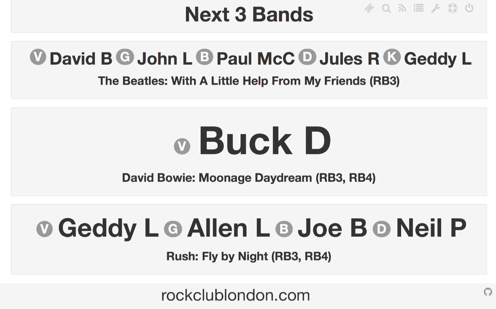
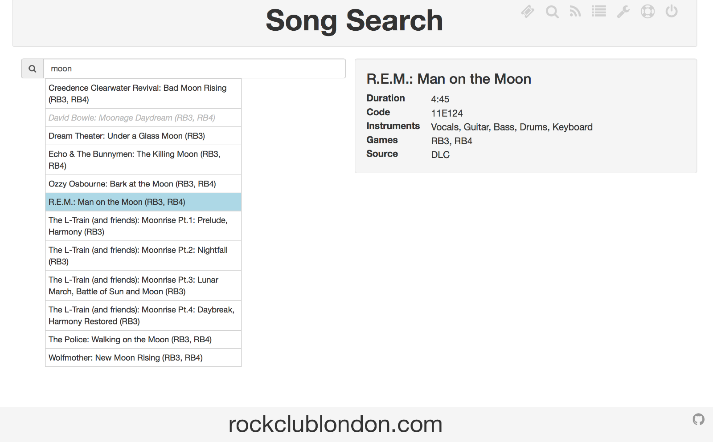
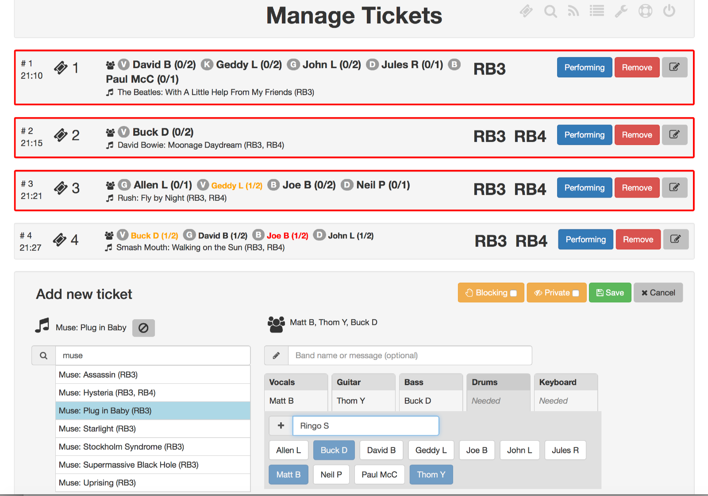

**takeAticket** exists to smooth the running of Karaoke sessions, Rock Club evenings, or any event where attendees sign up to perfom songs from a set list.

-----

Users can browse an online catalogue of songs (uploaded by the event runner) and see which have already been picked (greyed out), then request the song 
(currently done offline, although online signup will follow - at Rock Club London, users fill out request slips listing their band)

-----

A powerful queue management interface allows event runners to quickly enter requests and drag tickets to re-order the queue to ensure 
everyone gets a fair turn. Time estimates show how long the existing queue will last and colour highlighting shows new performers and 
those performing repeatedly on consecutive songs.

Event runners can also add their own background image and styling via the management interface. Songs are uploaded from Excel spreadsheets
through a choice of processors which determine which instruments are available for each song - or you can upload as voice-only for karaoke.
[Custom processors](PROCESSORS.md) for different database structures or instruments can be added in minutes with a little understanding of 
PHP code  (not available on QuickStart without some technical knowledge).

------

The software is free, open source and extensible, and can be run with a single command under the Docker container platform 
(see [Quick Start](QUICKSTART.md)) or installed on your own webserver ([Installation](INSTALL.md)). 
Once installed, all operations can be carried out via the web interface.

-------

To contribute to development, see [CONTRIBUTING](CONTRIBUTING.md); for feature requests or queries feel free to 
[open a ticket](https://github.com/parsingphase/takeAticket/issues) - refer to the existing 
[TODO list](https://github.com/parsingphase/takeAticket/blob/master/TODO.md) for what's planned.
