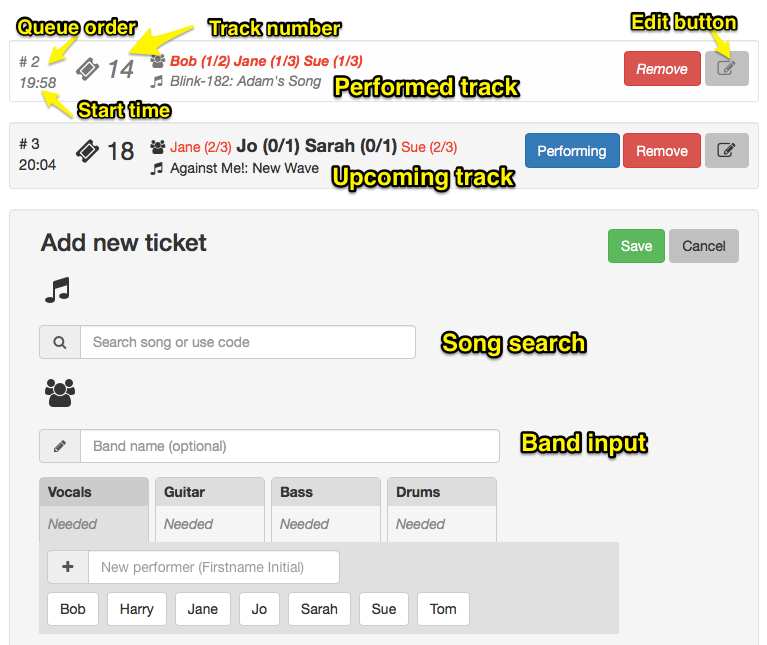
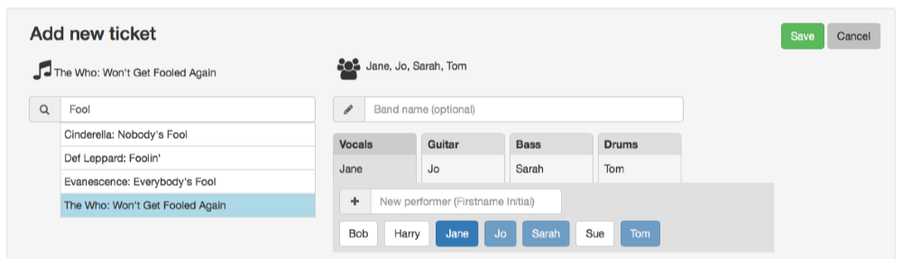

TakeATicket 
===========
| Travis | VersionEye | Scrutinizer |
| ---    | ---        | --- |
|  |  |   |

Queue management tool for Rock Club London (http://rockclublondon.com/)

Software created by Richard George (richard@phase.org)

Canonical source: https://github.com/parsingphase/takeAticket

## Quick start

You can use Docker to download and run the app locally in two steps:

 1) Install Docker from https://www.docker.com/community-edition#/download
 2) Run `docker run -i -t -p 8000:8000 parsingphase/takeaticket:latest` at a command line

Note that both these downloads are quite large, but both only need to be downloaded once until an update comes along.

Important notes:

The docker version of this software is not designed as a full production system, but you can use it on a closed system
if you understand the following limitations: 

 1) The admin account/password is locked to 'admin/admin' (password changing will follow later!)
 2) If you stop the running docker image, your queue and song list will be wiped.
 3) The image contains a small example song list, but you can upload more via the admin interface

## Setup

**WARNING** These steps are probably not entirely complete. See the [Dockerfile](Dockerfile) for the canonical list of setup steps.
If you've ever installed a Symfony project, you'll recognise most steps - refer to 
http://symfony.com/doc/current/setup.html#installing-an-existing-symfony-application

The app can use either a sqlite3 or mySQL database, and run under a standard server or PHP's internal server mode. 
The following instructions are for sqlite and the internal server; you can extrapolate from there to run it more 
professionally if you're familiar with mySQL, Apache and (ideally) Symfony.

To install the source code (requires Composer - https://getcomposer.org):

    git clone git@github.com:parsingphase/takeAticket.git
    cd takeAticket
    composer install
    ./vendor/bin/phing deploy-current
    
You'll then need to run various steps manually:     
 
To create database file/schema and create the admin user:

    sqlite3 var/db/app.sqlite < sql/db-sqlite.sql
    php bin/console doctrine:schema:update --force
    php bin/console fos:user:create admin admin@localhost adminpassword --super-admin

or create a mysql database and a user with DROP,SELECT,INSERT,UPDATE,DELETE permissions on that database, and load the 
`sql/db-mysql.sql` schema file

A couple of symlinks are required to make certain frontend resources available:

    mkdir -p web/docs
    ln -s ../components web/components
    ln -s ../../docs/images web/docs/images
 
To load song the library from a spreadsheet:

    php bin/console ticket:load-songs path/to/spreadsheet.xls
    
(file format to follow but see `Phase\TakeATicket\SongLoader::$fileFields`)
 
To start the app in PHP's internal server.

    ./startServer.sh

Running the app under any other server is left as an exercise to the reader. 

## Usage

Using the startServer script, the app runs on localhost & all attached IPs at port 8000 
(copy & edit `startServer.sh` to change this).
Visit http://localhost:8000 when the server is running. The URLs in the documentation below all assume that this is the 
server being used.

### Navigation
**Icons:** Upcoming, Search, RSS feed, Queue Management, Login

### Upcoming (index page)

Lists the next 3 bands up. Auto-updates when bands perform or order changes. If you have `'displayOptions' => ['songInPreview' => true ]`
set in config.php OR you're logged in as admin (see below), the song title will be shown as well as the band details.

### Search

http://localhost:8080/songSearch

Allows users to search for songs by band and/or title. Displays the first 10 hits when at least 3 characters are typed in the search box.

### RSS feed

For integration with other tools. Shows the next 3 upcoming bands.

### Manage Queue

Accessible to admins only. 

Tracks can be dragged into a new order. When a group starts performing, click "performing" and it'll be greyed out here and
vanish from the "upcoming" page. This also logs the time at which the track starts, which is used to estimate times for
upcoming tickets.

Tracks can be removed completely (eg if a band fails to appear) by clicking "remove". 
Don't remove performed tracks as it'll skew statistics and times. 

The statistics for each performer on each track show the number of songs performed by this user *before* 
the displayed track, and the total number they've signed up for. Performers are shown in red if they're scheduled to be 
on stage twice in quick succession.

Add a song by searching in the song field and clicking the appropriate result. 

Build a band by assigning performers to instruments. You *can* assign any number of performers to each instrument, but
in most cases (except vocals) this won't make sense. Assign by clicking name buttons or typing a new name into the New 
Performer field and hitting enter. Remove a name by clicking when the appropriate instrument is selected.

Assigning a performer will skip to the next instrument, so to add multiple performers you'll need to re-select the 
instrument.

You can also add a band name if you want, but this is optional.

Click "Add" to store the track once song names and band member lists appear above their respective inputs:

## TODO 

See [docs/TODO.md](./docs/TODO.md) for intended further work; 
feel free to [open issues on github](https://github.com/parsingphase/takeAticket/issues) to make feature requests, 
report bugs, or "upvote" existing tasks.

## CONTRIBUTING 

See [docs/CONTRIBUTING.md](./docs/CONTRIBUTING.md) for details on how to run included tests and/or contribute to the project.
